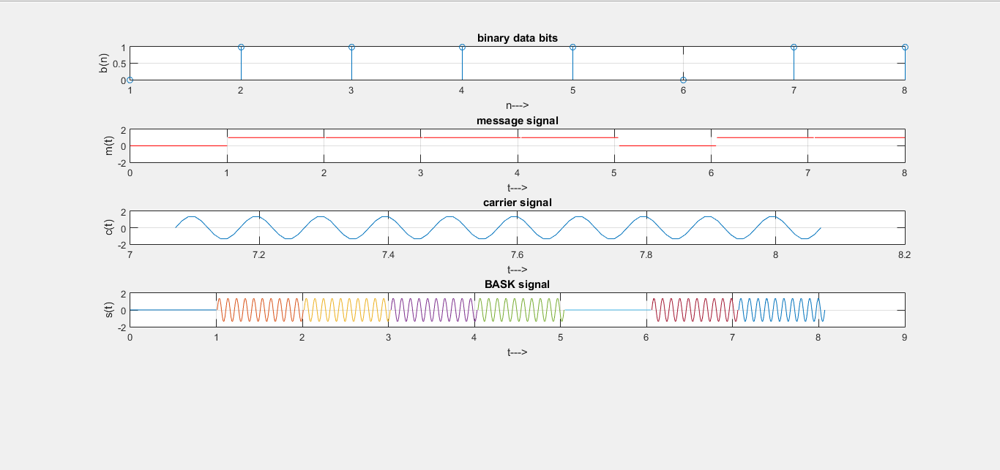

# Design

**For Modulation:**

 Modulation consists of conversion of the given input digital signal to output BASK 
 signal. This includes the following procedure:

 * A carrier signal is generated.

 * Using random number generator a random number of input digital signal bits is generated(message signal).

 * Then the carrier signal is converted to BASK dignal when the product of message and carrier signal is taken.

 * Finally the BASK signal is plotted. 

 On plotting using matlab the following result was obtained:

 

 **For Demodulation:**

 Demodulation consists of conversion of the output BASK wave to Discrete digital inputs which we had generated using random number generator.

 * For each signal element in BASK wave the product of carrier signal level and modulating signal level is calculated.

 * Based on the product the demodulated input data bits are plotted.

 On plotting using matlab the following result was obtained:

 

 **For finding the probability of bit error rate**

The graph of probability of bit error rate is plotted against Eb/Nowhere, Eb is signal energy per bit in the baseband signal and is the function of the number of bits that make up the signal energy and symbols in the baseband signal.
No is the noise power density in the baseband signal, and this value is obtained from the noise power and bandwidth of the receiver’s demodulator. A logarithmic graph is plotted for this sake and the equation includes :

This equation gives the probability of bit error rate which is plotted in matlab using erfc function and giving different values to Eb/No ratio. 