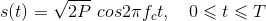

# Modulation
 Modulation is the process of varying some parameter of a periodic waveform in order to use that signal to convey a message. Normally a highfrequency sinusoidal waveform is used as carrier signal. For this purpose ,if the variation in the parameter of the carrier is continuous in accordance to the input analog signal the modulation technique is termed as analog modulation scheme if the variation is discrete then it is termed as digital modulation techniques.

# Amplitude shift keying

This is a type of digital modulation techniques.The BASK is obtained by the alteration of the amplitude of the carrier wave . It is a coherent modulation technique and has very poor bandwidth efficiency. The basic merit of this technique is its simple implementations but is highly prone to noise and the performance is well established only in the linear region which does not make it a viable digital modulation technique for wireless or mobile application in the present scenario.
Any modulated signal has a high frequency carrier. The binary signal when ASK modulated, gives a zero value for Low input while it gives the carrier output for High input.

<i style="margin:70px">This image depicts modulation and demodulation of BASK</i>

The modulation represented contains a digital signal converted to Amplitude shift keying output while the demodulated wave represents vice-versa.

The equation for binary amplitude shift keying can be written as:

where A is a constant,  m(t) = 1 or 0, fc is the carrier frequency, and T is the bit duration.  It has a power P = A2/2, so that A =&radic; 2P.  Thus equation can be written as:

 &nbsp;&nbsp;&nbsp;&nbsp; 

 &nbsp;&nbsp;&nbsp;&nbsp; 

where E = PT is the energy contained in a bit duration.

# Probability of bit error rate

Amplitude noise can be determined by determining the bit error rate. This bit error rate can be defined as the no of correct bits received in reference to the total number of bits transmitted. An error counter measures the number of incorrect bits received, where the transmitted and received data are compared bit by bit in a comparator. Thus error is detected. A plot is obtained after analysing about the noise that affects a given signal.

 **Eb/N0 :**

&nbsp;&nbsp;&nbsp;&nbsp;Signal to noise ratios and Eb/N0 figures are parameters that are more associated with radio links and radio communications systems. In terms of this, the bit error rate, BER, can also be defined in terms of the probability of error or POE. To determine this, three other variables are used. They are the error function, erf, the energy in one bit, Eb, and the noise power spectral density (which is the noise power in a 1 Hz bandwidth), N0.

The energy per bit, Eb, can be determined by dividing the carrier power by the bit rate and is a measure of energy with the dimensions of Joules. N0 is a power per Hertz and therefore this has the dimensions of power (joules per second) divided by seconds). Looking at the dimensions of the ratio Eb/N0 all the dimensions cancel out to give a dimensionless ratio. It is important to note that POE is proportional to Eb/N0 and is a form of signal to noise ratio.

It is possible to define the bit error rate in terms of a probability of error.

where:

erfc = error function

Eb = energy in one bit

N0 = power spectral density (noise in 1Hz bandwidth).

It is important to note that Eb/N0 is a form of signal to noise ratio.

The energy per bit, Eb can be determined by dividing the carrier power by the bit rate.As an energy measure, Eb has the unit of Joules. N0 is a measure of power (joules per second) per Hz, and as a result Eb/N0 is a dimensionless term and can be expressed simply as a ratio.

The error probability is seen to fall off monotonically with an increase in distance between the signals.
